BlindTouch
==========

Demo
----

[Watch the demo on YouTube](https://www.youtube.com/watch?v=nfyAUmTXU9E)

BlindTouch is a simulation-first tactile manipulation project. It trains and
evaluates a three-finger robotic claw that handles unfamiliar objects using
touch and proprioception alone, without camera input or object labels.

The project builds a complete MuJoCo and Gymnasium pipeline around a tactile
claw, randomized contact-rich objects, behavior-cloned touch policies, tactile
safety filtering, locked evaluation suites, and polished household-object
showcase rendering.

What Was Built
--------------

- A custom MuJoCo claw model with three radially arranged fingers and 27
  fingertip tactile cells.
- A Gymnasium environment that exposes only tactile pressure, joint state, and
  short observation history to the policy.
- Procedural object families covering round retention, asymmetric rigid
  contact, low-friction handling, fragile balance, and awkward poses.
- Skill teachers that generate successful touch trajectories for offline
  imitation learning.
- A hierarchical behavior-cloning policy with a touch-mode head and
  mode-conditioned continuous actions.
- A tactile safety filter that limits force spikes and protects fragile objects
  during rollout.
- Locked evaluation suites for repeatable policy selection and behavior
  comparison.
- A rendered household-object showcase with colored objects, tactile overlays,
  and success clips for presentation.

Model Approach
--------------

BlindTouch separates the problem into touch-only perception, mode selection,
continuous control, and safety filtering. The current best model is a
hierarchical behavior-cloned policy trained from successful tactile
demonstrations. It predicts a manipulation mode such as probing, stabilizing,
lifting, or releasing, then applies a mode-conditioned motor command for the
fingers and palm.

The policy never receives privileged object identity, labels, or visual input.
Household-style objects are used to visualize transfer behavior, while the
training and evaluation pipeline remains grounded in randomized procedural
objects.

Project Structure
-----------------

- `blindtouch/assets/claw.xml`: MuJoCo claw and scene definition.
- `blindtouch/env.py`: Gymnasium environment and tactile observation contract.
- `blindtouch/objects.py`: procedural object families and visual presets.
- `blindtouch/hierarchical_bc.py`: hierarchical behavior-cloning policy.
- `blindtouch/safety.py`: tactile safety filtering.
- `blindtouch/train.py`: training, warm starts, evaluation, and checkpoint
  selection.
- `scratch/render_household_showcase.py`: local showcase renderer.
- `assets/blindtouch_model_flow.svg`: system flow diagram.
